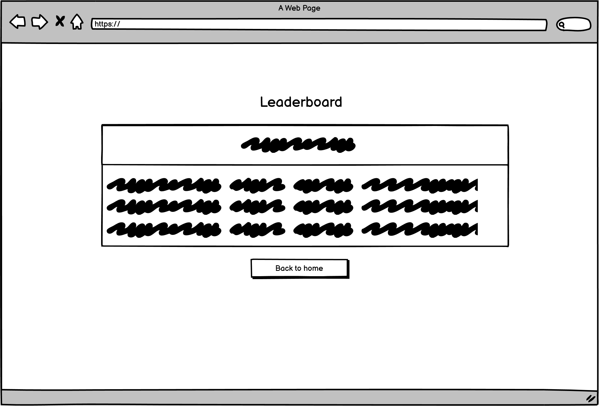
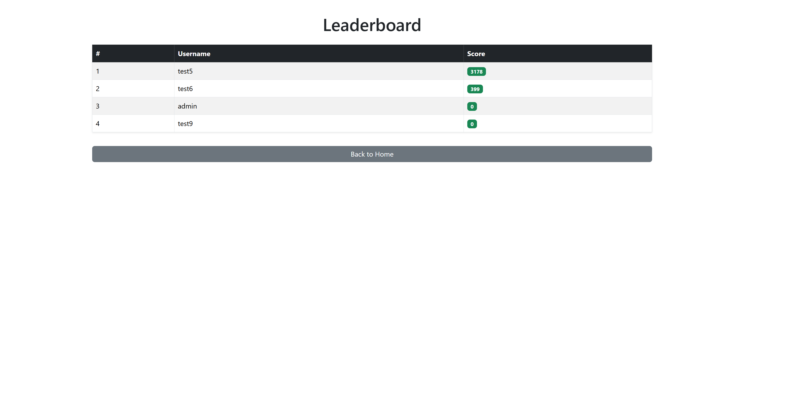

# MoneyMaker - Incremental Clicker Game

## Table of Contents

- [Introduction](#introduction)
- [Project Outline](#project-outline)
- [Key Objectives](#key-objectives)
- [UX Design](#ux-design)
- [User Stories](#user-stories)
- [Color Design](#color-design)
- [Wireframes](#wireframes)
- [Imagery](#imagery)
- [Features](#features)
  - [General Features](#general-features)
  - [Agile Section](#agile-section)
  - [Responsive Design](#responsive-design)
  - [AI Implementation](#ai-implementation)
- [Testing](#testing)
- [Optimization](#optimization)
- [Database](#database)
- [Deployment](#deployment)
- [Credit](#credit)

---

## Introduction

MoneyMaker is a Django-based incremental clicker game where users run virtual businesses, earn money, purchase upgrades, hire managers for automation, and compete on a leaderboard. The project emphasizes accessibility, responsive design, and community engagement through reviews.

## Project Outline

This project simulates a business management experience in a fun, gamified way. Players start with a basic business and expand their empire by reinvesting earnings, unlocking new businesses, and automating processes.

## Key Objectives

- Provide an engaging incremental game experience.
- Allow users to register, save progress, and compete.
- Enable community interaction through reviews and replies.
- Ensure accessibility and responsiveness across devices.

## UX Design

### User Stories

- As a new user, I want to easily register an account so I can save my progress and access the game from any device.
- As a returning user, I want to log in securely so I can continue building my business empire.
- As a player, I want to click on businesses to earn money so I can progress in the game.
- As a player, I want to purchase upgrades for my businesses so I can increase my earnings.
- As a player, I want to hire managers to automate my businesses so I can earn money even when not actively clicking.
- As a player, I want to unlock new types of businesses as I progress so the game remains engaging and rewarding.
- As a competitor, I want to view a leaderboard so I can compare my progress with other players and strive for a higher rank.
- As a community member, I want to leave reviews about the game so I can share my feedback and experiences.
- As a user, I want to read reviews and replies from other players so I can learn tips and feel part of the community.
- As a review author, I want to edit or delete my own reviews so I can manage my contributions.
- As a user with accessibility needs**, I want to navigate the site using only my keyboard and screen reader so I can play the game without barriers.
- As a mobile user, I want the game interface to adapt to my device so I can play comfortably on any screen size.

## Color Design

- The color scheme of the project is intentionally simple and efficient, focusing on clarity and usability. By using a minimal palette, the design maintains a clean and modern aesthetic that avoids visual clutter. This approach enhances readability and ensures that key elements stand out, supporting both user experience and accessibility. The streamlined color choices also contribute to faster development and easier maintenance.

## Wireframes

- Wireframes were created for desktop and mobile layouts, focusing on clear business panels, upgrade buttons, and review sections.

Homepage:


Leaderboard:


Review:


Play page:


## Imagery

- Uses simple, friendly icons for businesses and upgrades.
- All images include descriptive alt text for accessibility.

## Features

### General Features

- Incremental gameplay with multiple business types.
- Upgrades and managers for automation.
- Leaderboard for competition.
- Review and reply system.
- Authentication and user profiles.

### Agile Section

Throughout this project, I adopted an agile workflow and methodology. Due to time constraints, I continuously iterated and performed bug testing, focusing on refining the core features before expanding the project scope. For example, in this final version, authors can self-publish, while some features like the reading function were deprioritized. My main priority was to perfect the essential functionalities before moving on to additional features.

At the outset, I established a project board to track user stories and monitor progress using 'To Do', 'In Progress', and 'Done' columns. Each user story was assigned a 'MOSCOW' prioritization tag (Must have, Should have, Could have, Won't have), following the Kanban method for effective workflow management.

The evolution of the project can be seen by comparing the original wireframes with the current deployed website. Here is my project board:
<a href="https://github.com/users/ajshirlow7/projects/1" target="_blank" rel="noopener noreferrer">| MoneyMaker project board |</a>

Homepage:


Leaderboard page:


HReview page:


Play page:


### Responsive Design

- To enhance development efficiency, particularly in handling responsiveness, I chose to implement the Bootstrap framework. After some trial and error, I successfully built a fully responsive page that aligns with modern design standards. Instead of relying on Bootstrap’s built-in carousels, which introduced unexpected technical issues that conflicted with my original wireframes, I opted to develop a custom JavaScript solution for the shelving functionality. This approach allowed me to maintain both visual consistency and full control over responsiveness, particularly through tailored media queries.

### AI Implementation

- Code Development
Throughout the project, I utilized AI tools such as Copilot, Claude, and ChatGPT to streamline the development process. These tools allowed me to quickly generate Bootstrap components without needing to manually search the official documentation, significantly speeding up development in a time-constrained environment. I also relied on AI to help write, refine, and troubleshoot code when I encountered roadblocks, allowing me to maintain momentum and stay on schedule.

- Debugging
AI tools played a key role in identifying and resolving bugs or adjusting my code to better align with the project's design goals. What could have taken hours of manual debugging and research was often resolved in minutes using Copilot, Claude, or ChatGPT. This approach saved valuable time and improved the overall quality of the code.

- Workflow Optimization
AI proved especially useful for handling repetitive or routine coding tasks, giving me more time and focus for complex or creative aspects of the build. This also applied to tasks involving Bootstrap integration, where AI helped reduce setup time significantly.

- Practical Use
To optimize my workflow, I often selected specific portions of my code and provided detailed prompts to Claude or Copilot for targeted debugging, optimization, or refactoring. When generating new code, I broke down the required functionality into concise bullet points, which helped ensure that the AI-generated output closely matched the intended outcome. Afterward, I refined the code manually to align it even more closely with project requirements. For debugging, especially with CSS media queries, I found it effective to isolate the problematic sections and ask AI to analyze and fix them. This targeted method helped me resolve layout issues more efficiently and improve responsiveness across devices.

## Testing

- Manual and automated testing for all major features.
- Accessibility tested with keyboard and screen readers.
- Lighthouse audits for performance and best practices.

Lighthouse scores:


Nu Html Checker:

Homepage:


Review Page:


Leadboard Page:


Play Page:


CSS Validation:


Javascript checker for the play page which uses javascript heavily for game functionality:

Play page:


Python Validation:

Homepage:


Leaderboard:


Review:


Game:


## Optimization

- Optimized images and static files for fast loading.
- Database queries optimized for leaderboard and reviews.

## Database

- I used Code Institute's PostgreSQL database.

To create a database with Code Institute's PostgreSQL service:

1. Navigate to PostgreSQL from Code Institute.
2. Enter your student email address in the input field provided.
3. Click **Submit**.
4. Wait while the database is created.
5. Check your email for a confirmation message.
6. You will receive a URL that you can use to connect your app to your database.

## Deployment

## Git Commands: Add, Commit, and Push to GitHub

1. **Stage your changes**  
   This command adds all changed files to the staging area:
   ```
   git add .
   ```
   Or, to add a specific file:
   ```
   git add path/to/your/file
   ```

2. **Commit your changes**  
   This command commits the staged changes with a message describing what you changed:
   ```
   git commit -m "Your commit message here"
   ```

3. **Push your changes to GitHub**  
   This command pushes your commits to the main branch on GitHub:
   ```
   git push origin main

- Deployed on Heroku for live demo.

Heroku
 is a cloud platform that lets developers create, deploy, monitor and manage apps.

You will need a Heroku log-in to be able to deploy a website to Heroku.

Once you have logged into Heroku:

Click 'New' > 'Create new app'

Choose a unique name, choose your region and press 'Create app'

Click on 'Settings' and then 'Reveal Config Vars'

Add a key of 'DISABLE_COLLECTSTATIC' with a value of '1'.

Add a key of 'DATABASE_URL' - the value will be the URL you were emailed when creating your database.

Add a key of 'SECRET_KEY' - the value will be any random secret key (google 'secret key generator' and use it to generate a random string of numbers, letters and characters)

In your terminal, type the code you will need to install project requirements:

pip3 install gunicorn~=20.1

pip3 install -r requirements.txt

pip3 freeze --local > requirements.txt

Create an 'env.py' file at the root directory which contains the following:

import os

os.environ["DATABASE_URL"]='CI database URL'

os.environ["SECRET_KEY"]=" Your secret key"

Create a file at the root directory called Procfile. In this file enter: "web: gunicorn my_project.wsgi" (without the quotes)

In settings.py, set DEBUG to False.

YOU SHOULD ALWAYS SET DEBUG TO FALSE BEFORE DEPLOYING FOR SECURITY

Add ",'.herokuapp.com' " (without the double quotes) to the ALLOWED_HOSTS list in settings.py

Add, commit and push your code.

Go back to Heroku, click on the 'Deploy' tab.

Connect your project to GitHub.

Scroll to the bottom and click 'Deploy Branch'.


# Edit local_settings.py with your PostgreSQL credentials
Run migrations:
python manage.py migrate
Create superuser (optional):
python manage.py createsuperuser
Run development server:
python manage.py runserver


## Credit

As I approach the completion of this project, which marks one of my final modules, I’d like to extend my heartfelt thanks to the Code Institute team for their excellent instruction, continuous support, and professionalism. The knowledge and skills I’ve gained over the last 16 weeks have been truly transformative, and I’m deeply appreciative of the encouragement that helped me reach this important milestone.


